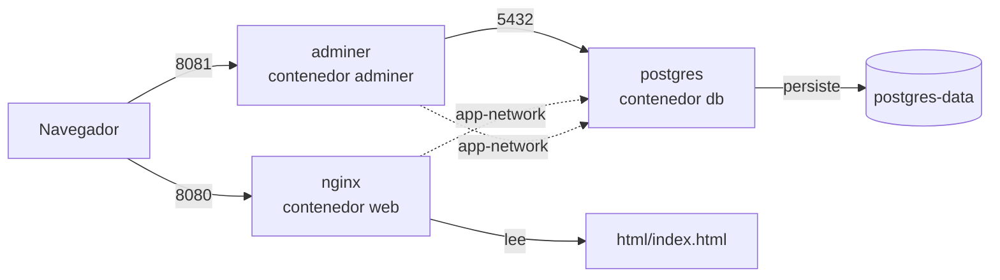
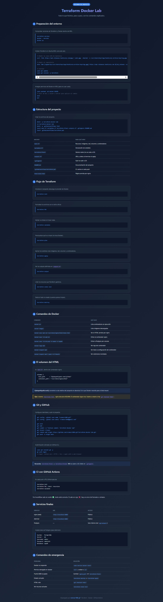
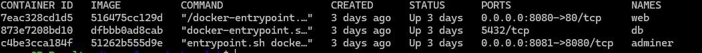

# Terraform Docker Lab


Laboratorio local de **Infrastructure as Code** donde se despliega un stack de servicios con **Terraform** sobre **Docker**. Todo el proyecto está versionado en Git y validado con **GitHub Actions**.


---

## Qué incluye

| Servicio   | Imagen               | URL                     | Acceso      |
|------------|----------------------|-------------------------|-------------|
| **nginx**  | `nginx:1.25-alpine`  | http://localhost:8080   | Público     |
| **Adminer**| `adminer:latest`     | http://localhost:8081   | Público     |
| **Postgres** | `postgres:15`      | —                       | Solo interno|

- **nginx** sirve una página HTML personalizada montada desde `html/`.
- **Adminer** es una interfaz web para gestionar Postgres.
- **Postgres** corre en una red interna, sin puerto expuesto al exterior.

---

## Arquitectura



---

## Estructura del proyecto

```text
terraform-docker-lab/
├── .github/
│   └── workflows/
│       └── terraform.yml       # CI: valida en cada push
├── html/
│   └── index.html              # Página servida por nginx
├── .gitignore                  # Qué NO subir a Git
├── main.tf                     # Recursos de Terraform
├── variables.tf                # Declaración de variables
├── terraform.tfvars            # Valores locales (NO se sube a Git)
├── terraform.tfvars.example    # Plantilla pública de variables
├── outputs.tf                  # URLs y datos al aplicar
└── README.md
```

---

## Instalación de dependencias

### Docker

```bash
sudo apt update && sudo apt install -y docker.io
sudo usermod -aG docker $USER
# Cerrar y reabrir WSL para aplicar el grupo
```

### Terraform

```bash
curl -fsSL https://apt.releases.hashicorp.com/gpg | sudo gpg --dearmor -o /usr/share/keyrings/hashicorp-archive-keyring.gpg
echo "deb [signed-by=/usr/share/keyrings/hashicorp-archive-keyring.gpg] https://apt.releases.hashicorp.com $(lsb_release -cs) main" | sudo tee /etc/apt/sources.list.d/hashicorp.list
sudo apt update && sudo apt install -y terraform
```

---

## Cómo desplegar

### 1. Clonar el repositorio

```bash
git clone https://github.com/vramosr1986-gif/terraform-docker-lab.git
cd terraform-docker-lab
```

### 2. Crear `terraform.tfvars`

Este archivo **no está en Git** por seguridad. Créalo a partir de la plantilla:

```bash
cp terraform.tfvars.example terraform.tfvars
```

Y edítalo con tus valores:

```hcl
nginx_port        = 8080
postgres_password = "cambia-esto-por-algo-seguro"
```

> ⚠️ **Seguridad:** no reutilices contraseñas reales ni subas `terraform.tfvars` a Git. Para un lab local vale cualquier valor; para algo serio, usa variables de entorno o un gestor de secretos.

### 3. Inicializar, validar y aplicar

```bash
terraform init
terraform fmt
terraform validate
terraform plan
terraform apply
```

Escribe `yes` cuando pregunte.

### 4. Ver los outputs

```bash
terraform output
```

Debe mostrar:

```text
adminer_url        = "http://localhost:8081"
nginx_url          = "http://localhost:8080"
postgres_container = "db"
```

### 5. Destruir el stack

Cuando termines, limpia los recursos con:

```bash
terraform destroy
```

---

## `.gitignore` recomendado

```gitignore
# Terraform
.terraform/
.terraform.lock.hcl
*.tfstate
*.tfstate.*
crash.log
*.tfvars
!terraform.tfvars.example

# Editor / SO
.vscode/
.idea/
.DS_Store
```

---

## CI con GitHub Actions

El workflow `.github/workflows/terraform.yml` se ejecuta en cada `push` y `pull_request`, realizando:

- `terraform fmt -check`
- `terraform init -backend=false`
- `terraform validate`

---

## Capturas

### nginx sirviendo el HTML


### Adminer conectado a Postgres



### Contenedores corriendo


